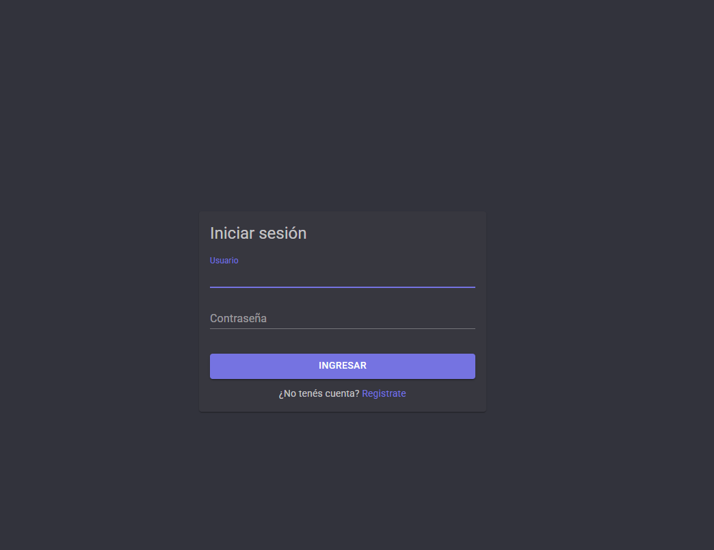
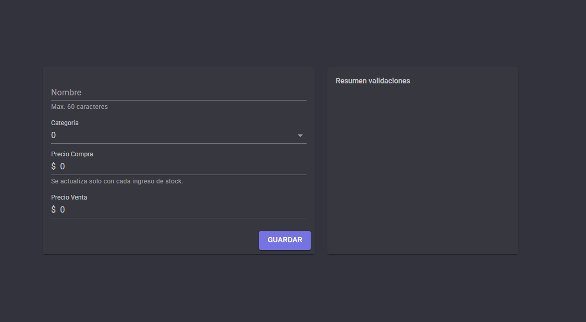
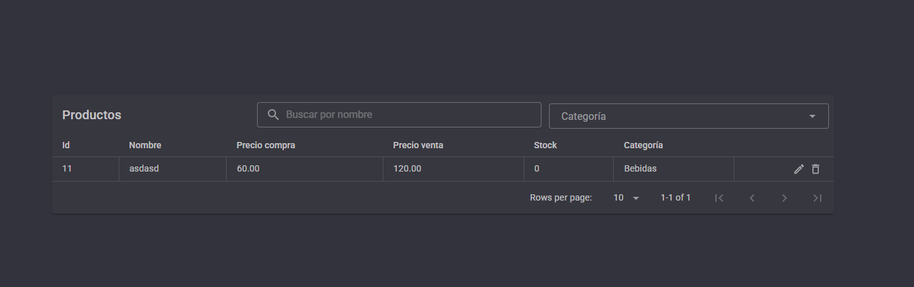
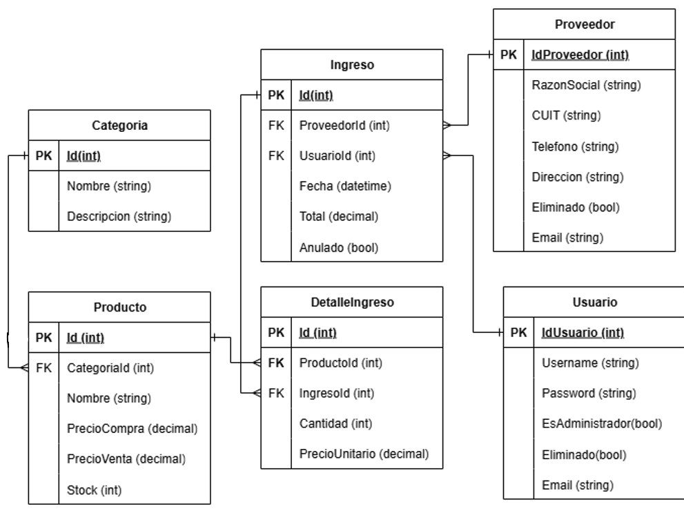

# TP2 Programación Web

Aplicación web para gestionar proveedores, categorías, productos e ingresos de mercadería. Desarrollada como trabajo práctico de Programación Web, utiliza Blazor con interactividad del lado del servidor y PostgreSQL para persistir los datos.

## Funcionalidades

- Registro de usuarios, inicio y cierre de sesión.
- Alta, consulta, edición y baja de proveedores.
- Alta, consulta y edición de categorías.
- Alta, consulta, edición y baja lógica de productos.
- Búsqueda de productos por nombre y filtro por categoría.
- Listados paginados.
- Registro de ingresos con proveedor y detalle de productos, cantidades y precios.
- Consulta del detalle y anulación de ingresos.
- Actualización del stock y del precio de compra al registrar mercadería.
- Validaciones de formularios, mensajes de error y cambio entre tema claro y oscuro.

## Capturas de pantalla

### Inicio de sesión



### Alta de productos



### Listado de productos



## Tecnologías

| Tecnología | Uso |
| --- | --- |
| C# y .NET 10 | Lenguaje y plataforma de ejecución |
| ASP.NET Core y Blazor | Aplicación web con modo `InteractiveServer` |
| MudBlazor | Componentes de interfaz, formularios y grillas |
| Entity Framework Core 10 | Acceso a datos y migraciones |
| PostgreSQL y Npgsql | Base de datos y proveedor de EF Core |
| BCrypt.Net-Next | Hash y verificación de contraseñas |
| ProtectedSessionStorage | Almacenamiento protegido de la sesión |
| Serilog | Registro de eventos y errores |

Las versiones concretas de las dependencias se encuentran en [TP2ProgramacionWeb.Frontend.csproj](TP2ProgramacionWeb.Frontend/TP2ProgramacionWeb.Frontend.csproj).

## Requisitos

- SDK de .NET 10.
- Una instancia de PostgreSQL en ejecución y credenciales con permisos para crear y modificar el esquema de la base de datos.
- Herramienta `dotnet-ef` compatible con EF Core 10. El proyecto utiliza la versión `10.0.12` de EF Core.
- Acceso a NuGet para restaurar dependencias.

## Configuración y ejecución

Los siguientes comandos están preparados para PowerShell. Ejecutarlos desde la raíz del repositorio, salvo que se indique lo contrario.

### 1. Restaurar las dependencias

```powershell
cd TP2ProgramacionWeb.Frontend
dotnet restore
```

Si la herramienta de migraciones todavía no está instalada:

```powershell
dotnet tool install --global dotnet-ef --version 10.0.12
```

Si ya está instalada, comprobar su versión con `dotnet ef --version`. Para actualizarla a la versión del proyecto:

```powershell
dotnet tool update --global dotnet-ef --version 10.0.12
```

### 2. Preparar PostgreSQL

Crear una base de datos, por ejemplo `tp2_programacion_web`, desde pgAdmin o una sesión de PostgreSQL:

```sql
CREATE DATABASE tp2_programacion_web;
```

El nombre es un ejemplo: puede usarse otro, siempre que coincida con la cadena de conexión.

### 3. Configurar la conexión

La aplicación lee la clave `ConnectionStrings:DefaultConnection`. Los archivos `appsettings.json` incluidos en el repositorio no contienen esa cadena.

El proyecto ya tiene un `UserSecretsId` configurado. Para guardar la conexión local, ejecutar desde `TP2ProgramacionWeb.Frontend`:

```powershell
dotnet user-secrets set "ConnectionStrings:DefaultConnection" "Host=localhost;Port=5432;Database=tp2_programacion_web;Username=TU_USUARIO;Password=TU_PASSWORD"
```

Reemplazar el servidor, puerto, nombre de base, usuario y contraseña por los valores del entorno local. Los secretos de usuario se cargan en el entorno `Development`.

Como alternativa, se puede configurar una variable de entorno en la terminal donde se ejecutará la aplicación:

```powershell
$env:ConnectionStrings__DefaultConnection = "Host=localhost;Port=5432;Database=tp2_programacion_web;Username=TU_USUARIO;Password=TU_PASSWORD"
```

### 4. Aplicar las migraciones

Desde `TP2ProgramacionWeb.Frontend`, con PostgreSQL disponible y la conexión configurada:

```powershell
$env:ASPNETCORE_ENVIRONMENT = "Development"
dotnet ef database update
```

Este comando aplica las migraciones incluidas en `Migrations/`. La aplicación no las ejecuta automáticamente al arrancar.

### 5. Ejecutar la aplicación

Para usar el perfil HTTPS, confiar primero en el certificado de desarrollo si todavía no se hizo:

```powershell
dotnet dev-certs https --trust
dotnet run --launch-profile https
```

Abrir [https://localhost:7148](https://localhost:7148). El perfil también configura `http://localhost:5108` y la aplicación utiliza redirección a HTTPS.

Los puertos y perfiles están definidos en [launchSettings.json](TP2ProgramacionWeb.Frontend/Properties/launchSettings.json).

## Primer uso

1. Abrir `/registro` y crear una cuenta con un nombre de usuario, un correo válido y una contraseña de al menos seis caracteres.
2. Al completar el registro, la sesión se inicia automáticamente.
3. Crear una categoría y un proveedor desde el menú lateral.
4. Crear un producto y asignarle una categoría. Su stock inicial es cero.
5. Registrar un ingreso, seleccionando el proveedor e indicando los productos, sus cantidades y sus precios unitarios.
6. Consultar los productos para verificar el stock o abrir el listado de ingresos para ver el detalle de la operación.

El repositorio no incluye usuarios precargados ni una cuenta de administrador inicial. Las cuentas creadas mediante el registro reciben el rol `Usuario`.

## Rutas principales

| Ruta | Pantalla |
| --- | --- |
| `/` | Inicio |
| `/login` | Inicio de sesión |
| `/registro` | Registro de usuario |
| `/proveedores/insert` | Alta de proveedor |
| `/proveedores/view` | Consulta, edición y baja de proveedores |
| `/categorias/insert` | Alta de categoría |
| `/categorias/view` | Consulta y edición de categorías |
| `/productos/insert` | Alta de producto |
| `/productos/view` | Consulta, edición y baja de productos |
| `/ingresos/insert` | Registro de ingreso de mercadería |
| `/ingresos/view` | Consulta, detalle y anulación de ingresos |

## Arquitectura

La solución contiene un único proyecto web: `TP2ProgramacionWeb.Frontend`. A pesar de su nombre, también contiene los servicios de negocio y el acceso a PostgreSQL. Los componentes interactivos se ejecutan en el servidor y llaman a los servicios mediante inyección de dependencias.

```text
Componentes Razor
    -> Servicios de negocio
        -> Interfaces de repositorios
            -> Repositorios con Entity Framework Core
                -> DataContext -> PostgreSQL
```

```text
TP2ProgramacionWeb.Frontend/
├── Components/       # Páginas, layouts y configuración de rutas
├── Data/             # DbContext y configuraciones de entidades
├── DTO/              # Objetos de solicitud y respuesta
├── Excepciones/      # Excepciones de la aplicación
├── Implementacion/   # Repositorios implementados con EF Core
├── Migrations/       # Migraciones del esquema de PostgreSQL
├── Models/           # Entidades y modelos auxiliares
├── Repositories/     # Interfaces de repositorios
├── Services/         # Lógica de negocio y estado de autenticación
├── Utilidades/       # Validaciones, roles y manejo de errores de interfaz
├── Viewmodel/        # Modelos utilizados por formularios y grillas
├── wwwroot/          # Archivos estáticos
└── Program.cs        # Registro de servicios y configuración de la aplicación
```

### Diagrama de entidad-relación



## Autenticación y autorización

### Autenticación

1. `Login.razor` envía las credenciales a `LoginService`.
2. El servicio busca al usuario mediante `IUsuarioRepository` y verifica la contraseña con `BCrypt.EnhancedVerify()`.
3. Si las credenciales son correctas, devuelve el ID, el nombre y el rol del usuario.
4. `AuthStateProvider.IniciarSesion()` guarda esos datos en `ProtectedSessionStorage`, con la clave `sesion`.
5. El proveedor crea un `ClaimsPrincipal` con los claims `NameIdentifier`, `Name` y `Role`, y notifica el cambio a los componentes de Blazor.

Las contraseñas se almacenan como hashes generados con `BCrypt.EnhancedHashPassword()`. La sesión guardada contiene únicamente el ID, el nombre y el rol, sin la contraseña ni su hash.

Al recuperar la sesión, `AuthStateProvider` reconstruye la identidad desde el almacenamiento protegido. Al cerrar sesión, elimina los datos guardados, notifica el estado anónimo y se navega a `/login`.

Aunque el proyecto referencia el paquete `JwtBearer`, el flujo actual utiliza el proveedor de estado propio de Blazor y no genera ni valida tokens JWT.

### Autorización actual

`MainLayout.razor` utiliza `AuthorizeView` para mostrar el cuerpo de las páginas a usuarios autenticados. Si no hay una sesión válida, se redirige al login. Las pantallas de login y registro utilizan `AuthLayout` y son accesibles sin iniciar sesión.

Los roles se calculan a partir de `Usuario.EsAdministrador`:

| Valor | Rol |
| --- | --- |
| `true` | `Administrador` |
| `false` | `Usuario` |

Actualmente no hay restricciones de operaciones por rol: ambos roles acceden a las mismas funciones desde la interfaz. El control está implementado en el layout; los servicios de negocio no incorporan comprobaciones de permisos y las rutas utilizan `RouteView`, sin atributos `[Authorize]`.

El ID del usuario autenticado también se utiliza al registrar un ingreso, para asociar la operación con quien la realizó.

## Reglas de negocio destacadas

- Los productos se crean con stock cero.
- Un ingreso debe tener al menos un producto, con cantidad y precio unitario mayores que cero.
- Un mismo producto no puede repetirse en el detalle de un ingreso.
- Registrar un ingreso incrementa el stock y actualiza el precio de compra de los productos involucrados.
- Anular un ingreso revierte el stock agregado. Se rechaza la anulación si dejaría algún producto con stock negativo o si el ingreso ya estaba anulado.
- La baja de productos es lógica, para conservar las relaciones con los ingresos históricos.
- Los filtros globales de EF Core excluyen de las consultas habituales a usuarios, proveedores y productos dados de baja.

## Comprobaciones de desarrollo

Desde la raíz del repositorio se puede compilar la solución con:

```powershell
dotnet build TP2ProgramacionWeb.slnx
```

La solución actualmente no incluye un proyecto de pruebas automatizadas. Para comprobar el flujo principal, crear una cuenta, una categoría, un proveedor y un producto; registrar un ingreso y verificar que el stock aumente; luego anularlo y comprobar que el stock vuelva al valor anterior.

## Problemas frecuentes

| Problema | Qué revisar |
| --- | --- |
| Error al conectarse a PostgreSQL | Que el servidor esté iniciado y que `ConnectionStrings:DefaultConnection` tenga los datos correctos |
| No se encuentran tablas o columnas | Ejecutar `dotnet ef database update` contra la misma base que utiliza la aplicación |
| `dotnet ef` no está disponible | Instalar la herramienta global y volver a abrir la terminal si es necesario |
| Error con el certificado HTTPS | Ejecutar `dotnet dev-certs https --trust` |
| La sesión deja de ser válida después de cambiar las claves de protección | Volver a iniciar sesión |
